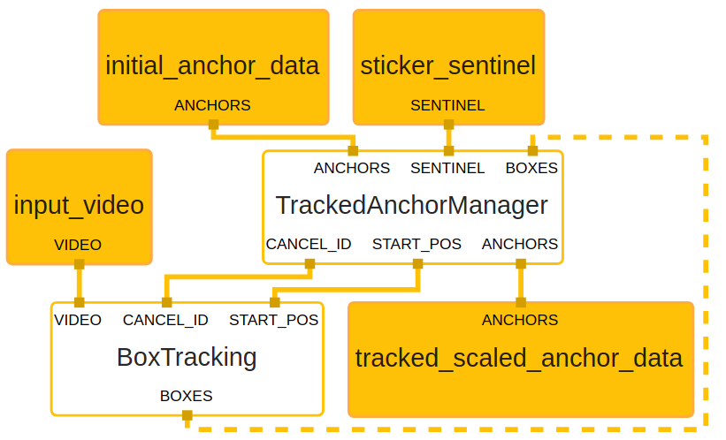

# Instant Motion Tracking

**This is not an officially supported Google product.**

This repository contains the Instant Motion Tracking project
using MediaPipe.

This document focuses on the [below graph](#main-graph) that performs instant motion tracking.

For overall context on instant motion tracking, please read this [paper](https://arxiv.org/abs/1907.06796).

 

## Android

[Source](mediapipe/examples/android/src/java/com/google/mediapipe/apps/instantmotiontracking)

To build and install the app, the MediaPipe repository must first be cloned from Github:

```bash
git clone https://github.com/google/mediapipe.git
```

Once you have the MediaPipe repository, clone this project as well:

```bash
git clone https://github.com/googleinterns/instant_motion_tracking.git
```

Next, run the following command to move the instantmotiontracking source graphs and calculators into the MediaPipe directory:

```bash
mv instant_motion_tracking/mediapipe/graphs/instantmotiontracking mediapipe/mediapipe/graphs/instantmotiontracking
```

It is also necessary move the Android source application to Mediapipe:

```bash
mv instant_motion_tracking/mediapipe/examples/android/src/java/com/google/mediapipe/apps/instantmotiontracking mediapipe/mediapipe/examples/android/src/java/com/google/mediapipe/apps/instantmotiontracking
```

Navigate to the mediapipe directory containing your WORKSPACE file and use the following commands to add Glide Image Loading dependencies to the Maven installation section: 

```bash
cd mediapipe

sed -i '/"com.google.guava:guava:27.0.1-android",/a "com.github.bumptech.glide:glide:4.11.0",' WORKSPACE 

sed -i '/"com.github.bumptech.glide:glide:4.11.0",/a "com.github.bumptech.glide:gifdecoder:4.11.0",' WORKSPACE 

# If you wish to avoid running the commands above (or run into issues), you can alternatively copy the following two dependencies to the 'artifacts' portion of maven_install:
#
# artifacts = [
# 	...
# 	"com.github.bumptech.glide:glide:4.11.0",
# 	"com.github.bumptech.glide:gifdecoder:4.11.0",
# ]
```

Due to BUILD dependency issues with related MediaPipe projects, you must change the visibility permissions of the object_tracking_3d calculators. Navigate back to the parent directory containing both 'instant_motion_tracking' and 'mediapipe' to run the command below to copy the modified BUILD file to fix privacy issues between projects:

```base
cd ../

mv instant_motion_tracking/installation/BUILD mediapipe/mediapipe/graphs/object_detection_3d/calculators/BUILD
```

Now, navigate to the MediaPipe directory and build the application via Bazel:

```bash
cd mediapipe

bazel build -c opt --config=android_arm64 mediapipe/examples/android/src/java/com/google/mediapipe/apps/instantmotiontracking
```

Once the app is built, install it on an Android device by transferring the apk via ADB:

```bash
adb install bazel-bin/mediapipe/examples/android/src/java/com/google/mediapipe/apps/instantmotiontracking/instantmotiontracking.apk
```

## Graph
The instant motion tracking [main graph](#main-graph) internally utilizes a [region tracking subgraph](#region-tracking-subgraph)
in order to perform anchor tracking for each individual 3d render (creating the AR effect).

### Main Graph

[Source pbtxt file](mediapipe/graphs/instantmotiontracking/instantmotiontracking.pbtxt)


```bash
# MediaPipe graph that performs region tracking and 3d object (AR sticker) rendering.

# Images in/out of graph with sticker data and IMU information from device
input_stream: "input_video"
input_stream: "sticker_sentinel"
input_stream: "sticker_proto_string"
input_stream: "imu_rotation_matrix"
input_stream: "gif_texture"
output_stream: "output_video"

# Converts sticker data into user data (rotations/scalings), render data, and
# initial anchors.
node {
  calculator: "StickerManagerCalculator"
  input_stream: "PROTO:sticker_proto_string"
  output_stream: "ANCHORS:initial_anchor_data"
  output_stream: "USER_ROTATIONS:user_rotation_data"
  output_stream: "USER_SCALINGS:user_scaling_data"
  output_stream: "RENDER_DATA:sticker_render_data"
}

# Uses box tracking in order to create 'anchors' for associated 3d stickers.
node {
  calculator: "RegionTrackingSubgraph"
  input_stream: "VIDEO:input_video"
  input_stream: "SENTINEL:sticker_sentinel"
  input_stream: "ANCHORS:initial_anchor_data"
  output_stream: "ANCHORS:tracked_anchor_data"
}

# Concatenates all transformations to generate model matrices for the OpenGL
# animation overlay calculator.
node {
  calculator: "MatricesManagerCalculator"
  input_stream: "ANCHORS:tracked_anchor_data"
  input_stream: "IMU_ROTATION:imu_rotation_matrix"
  input_stream: "USER_ROTATIONS:user_rotation_data"
  input_stream: "USER_SCALINGS:user_scaling_data"
  input_stream: "RENDER_DATA:sticker_render_data"
  output_stream: "MATRICES:0:robot_matrices"
  output_stream: "MATRICES:1:dino_matrices"
  output_stream: "MATRICES:2:gif_matrices"
  input_side_packet: "FOV:vertical_fov_radians"
  input_side_packet: "ASPECT_RATIO:aspect_ratio"
}

# Renders the final 3d stickers and overlays them on input image.
node {
  calculator: "GlAnimationOverlayCalculator"
  input_stream: "VIDEO:input_video"
  input_stream: "MODEL_MATRICES:robot_matrices"
  input_side_packet: "TEXTURE:robot_texture"
  input_side_packet: "ASSET:robot_asset_name"
  output_stream: "robot_rendered_video"
}

# Renders the final 3d stickers and overlays them on input image.
node {
  calculator: "GlAnimationOverlayCalculator"
  input_stream: "VIDEO:robot_rendered_video"
  input_stream: "MODEL_MATRICES:dino_matrices"
  input_side_packet: "TEXTURE:dino_texture"
  input_side_packet: "ASSET:dino_asset_name"
  output_stream: "dino_rendered_video"
}

# Renders the final 3d stickers and overlays them on input image.
node {
  calculator: "GlAnimationOverlayCalculator"
  input_stream: "VIDEO:dino_rendered_video"
  input_stream: "MODEL_MATRICES:gif_matrices"
  input_stream: "TEXTURE:gif_texture"
  input_side_packet: "ASSET:gif_asset_name"
  output_stream: "output_video"
}
```

### Region Tracking Subgraph



[Source pbtxt file](mediapipe/graphs/instantmotiontracking/subgraphs/region_tracking.pbtxt)

```bash
# MediaPipe graph that performs region tracking on initial anchor positions
# provided by the application

# Images in/out of graph with tracked and scaled normalized anchor data
type: "RegionTrackingSubgraph"
input_stream: "VIDEO:input_video"
input_stream: "SENTINEL:sticker_sentinel"
input_stream: "ANCHORS:initial_anchor_data"
output_stream: "ANCHORS:tracked_scaled_anchor_data"

# Manages the anchors and tracking if user changes/adds/deletes anchors
node {
 calculator: "TrackedAnchorManagerCalculator"
 input_stream: "SENTINEL:sticker_sentinel"
 input_stream: "ANCHORS:initial_anchor_data"
 input_stream: "BOXES:boxes"
 input_stream_info: {
   tag_index: 'BOXES'
   back_edge: true
 }
 output_stream: "START_POS:start_pos"
 output_stream: "CANCEL_ID:cancel_object_id"
 output_stream: "ANCHORS:tracked_scaled_anchor_data"
}

# Subgraph performs anchor placement and tracking
node {
  calculator: "BoxTrackingSubgraph"
  input_stream: "VIDEO:input_video"
  input_stream: "START_POS:start_pos"
  input_stream: "CANCEL_ID:cancel_object_id"
  output_stream: "BOXES:boxes"
}
```

### Box Tracking Subgraph


[Source pbtxt file](https://github.com/google/mediapipe/tree/master/mediapipe/graphs/tracking/subgraphs/box_tracking_gpu.pbtxt)

```bash
# MediaPipe box tracking subgraph.

type: "BoxTrackingSubgraph"

input_stream: "VIDEO:input_video"
input_stream: "BOXES:start_pos"
input_stream: "CANCEL_ID:cancel_object_id"
output_stream: "BOXES:boxes"

node: {
  calculator: "ImageTransformationCalculator"
  input_stream: "IMAGE_GPU:input_video"
  output_stream: "IMAGE_GPU:downscaled_input_video"
  node_options: {
    [type.googleapis.com/mediapipe.ImageTransformationCalculatorOptions] {
      output_width: 240
      output_height: 320
    }
  }
}

# Converts GPU buffer to ImageFrame for processing tracking.
node: {
  calculator: "GpuBufferToImageFrameCalculator"
  input_stream: "downscaled_input_video"
  output_stream: "downscaled_input_video_cpu"
}

# Performs motion analysis on an incoming video stream.
node: {
  calculator: "MotionAnalysisCalculator"
  input_stream: "VIDEO:downscaled_input_video_cpu"
  output_stream: "CAMERA:camera_motion"
  output_stream: "FLOW:region_flow"

  node_options: {
    [type.googleapis.com/mediapipe.MotionAnalysisCalculatorOptions]: {
      analysis_options {
        analysis_policy: ANALYSIS_POLICY_CAMERA_MOBILE
        flow_options {
          fast_estimation_min_block_size: 100
          top_inlier_sets: 1
          frac_inlier_error_threshold: 3e-3
          downsample_mode: DOWNSAMPLE_TO_INPUT_SIZE
          verification_distance: 5.0
          verify_long_feature_acceleration: true
          verify_long_feature_trigger_ratio: 0.1
          tracking_options {
            max_features: 500
            adaptive_extraction_levels: 2
            min_eig_val_settings {
              adaptive_lowest_quality_level: 2e-4
            }
            klt_tracker_implementation: KLT_OPENCV
          }
        }
      }
    }
  }
}

# Reads optical flow fields defined in
# mediapipe/framework/formats/motion/optical_flow_field.h,
# returns a VideoFrame with 2 channels (v_x and v_y), each channel is quantized
# to 0-255.
node: {
  calculator: "FlowPackagerCalculator"
  input_stream: "FLOW:region_flow"
  input_stream: "CAMERA:camera_motion"
  output_stream: "TRACKING:tracking_data"

  node_options: {
    [type.googleapis.com/mediapipe.FlowPackagerCalculatorOptions]: {
      flow_packager_options: {
        binary_tracking_data_support: false
      }
    }
  }
}

# Tracks box positions over time.
node: {
  calculator: "BoxTrackerCalculator"
  input_stream: "TRACKING:tracking_data"
  input_stream: "TRACK_TIME:input_video"
  input_stream: "START_POS:start_pos"
  input_stream: "CANCEL_OBJECT_ID:cancel_object_id"
  input_stream_info: {
    tag_index: "CANCEL_OBJECT_ID"
    back_edge: true
  }
  output_stream: "BOXES:boxes"

  input_stream_handler {
    input_stream_handler: "SyncSetInputStreamHandler"
    options {
      [mediapipe.SyncSetInputStreamHandlerOptions.ext] {
        sync_set {
          tag_index: "TRACKING"
          tag_index: "TRACK_TIME"
        }
        sync_set {
          tag_index: "START_POS"
        }
        sync_set {
          tag_index: "CANCEL_OBJECT_ID"
        }
      }
    }
  }

  node_options: {
    [type.googleapis.com/mediapipe.BoxTrackerCalculatorOptions]: {
      tracker_options: {
        track_step_options {
          track_object_and_camera: true
          tracking_degrees: TRACKING_DEGREE_OBJECT_SCALE
          inlier_spring_force: 0.0
          static_motion_temporal_ratio: 3e-2
        }
      }
      visualize_tracking_data: false
      streaming_track_data_cache_size: 100
    }
  }
}
```

## Licensing & Use

    Copyright 2020 Google LLC

    Licensed under the Apache License, Version 2.0 (the "License");
    you may not use this file except in compliance with the License.
    You may obtain a copy of the License at

        https://www.apache.org/licenses/LICENSE-2.0

    Unless required by applicable law or agreed to in writing, software
    distributed under the License is distributed on an "AS IS" BASIS,
    WITHOUT WARRANTIES OR CONDITIONS OF ANY KIND, either express or implied.
    See the License for the specific language governing permissions and
    limitations under the License.
